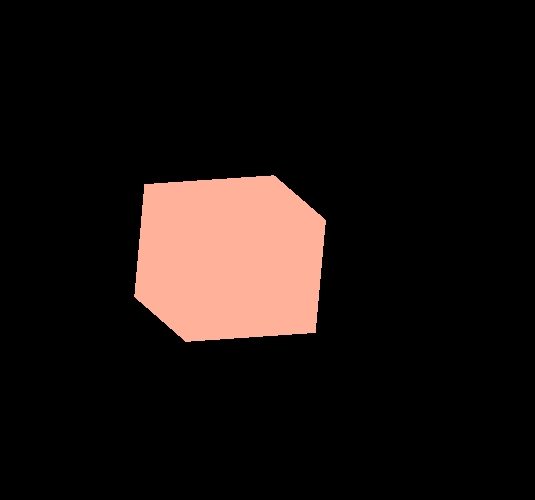
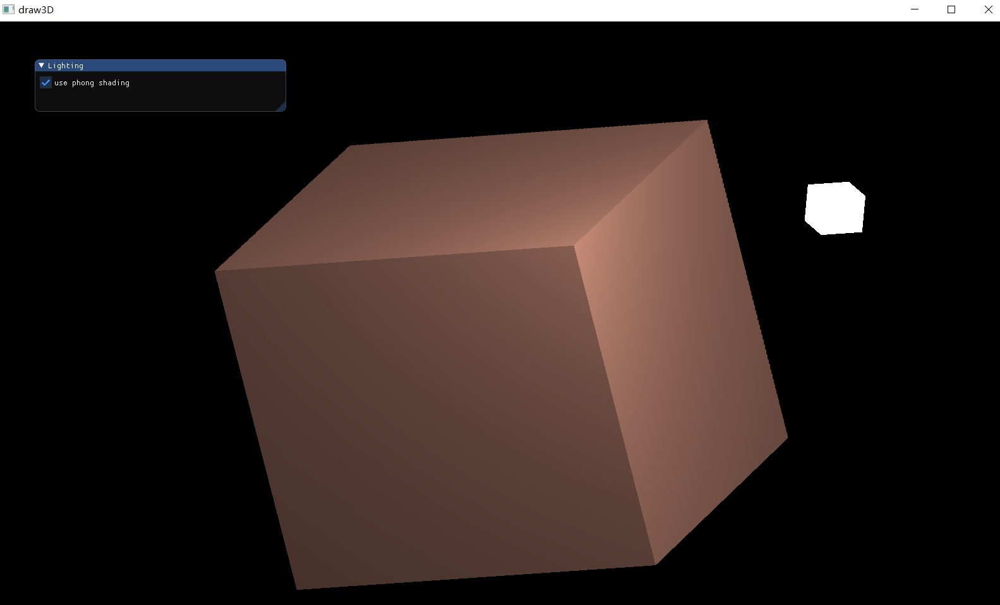
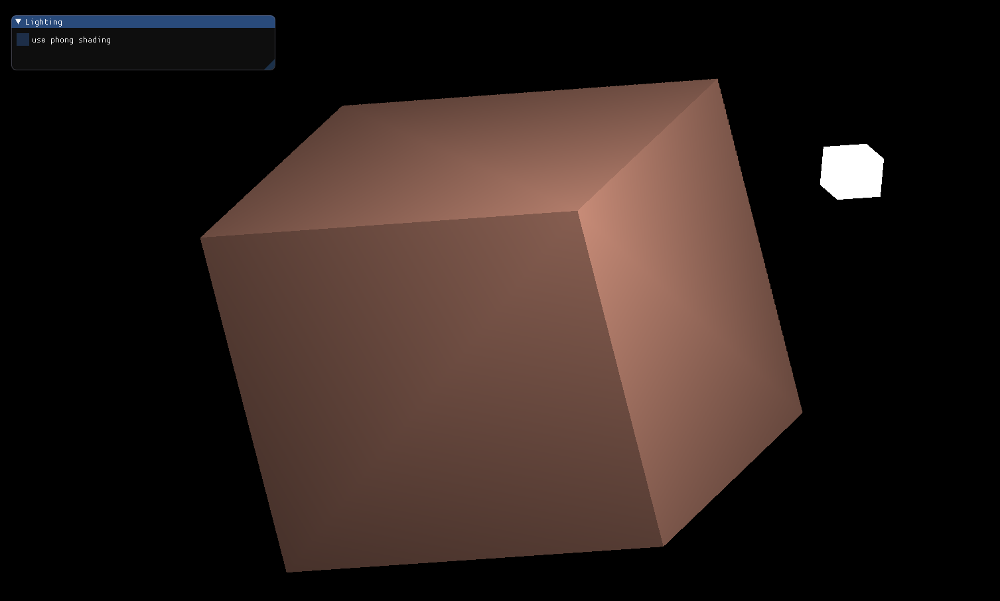
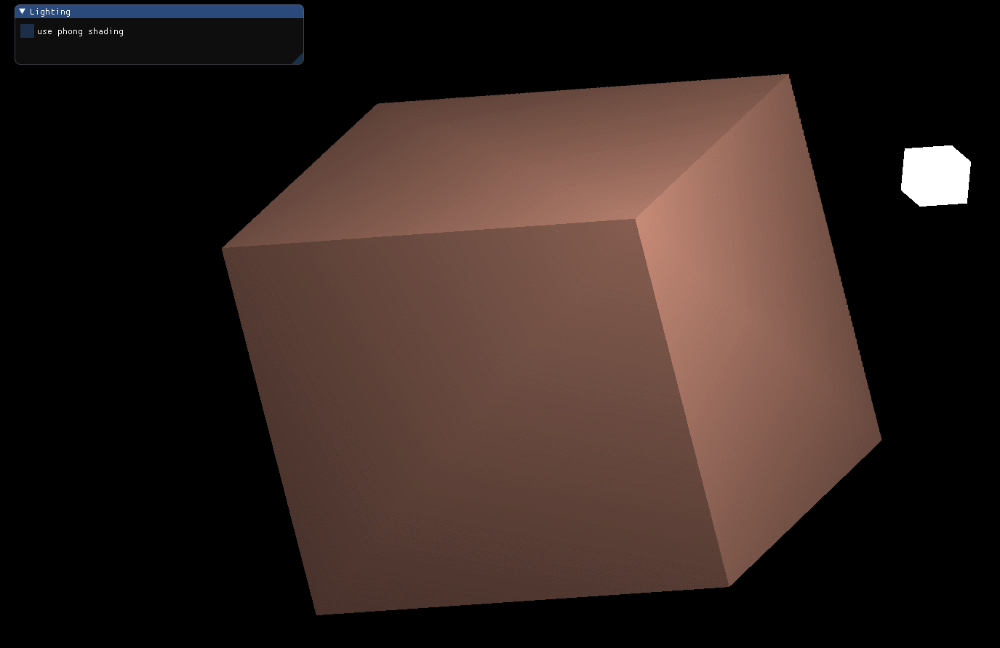
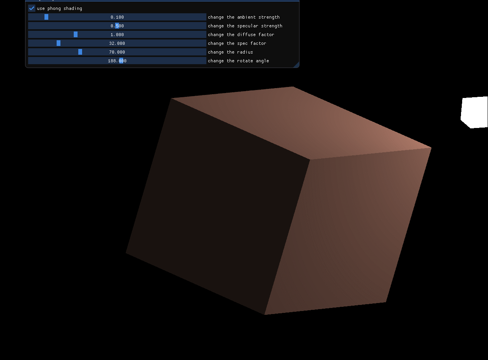
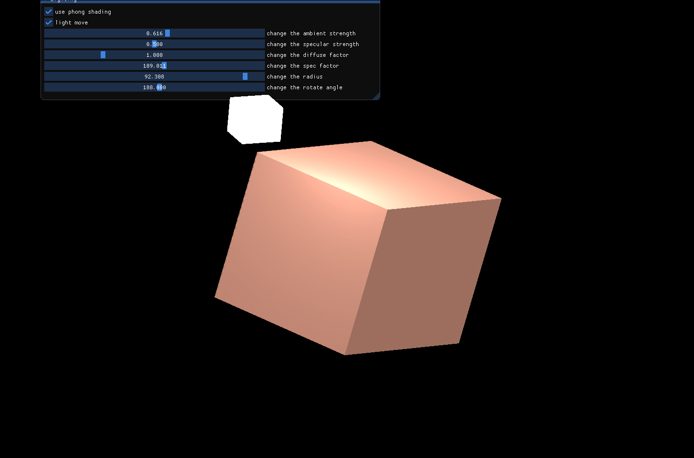

计算机图形学第六次作业

[TOC]


## 1.实现Phong光照模型

### 1.1 场景中绘制一个cube

  - 写出顶点坐标和颜色属性

  ```c++
  //顶点坐标初始化
  	float vertices[] = {
  	-0.2f, -0.2f, -0.2f,  0.0f, 0.5f, 0.1f,
  	 0.2f, -0.2f, -0.2f,  0.0f, 0.5f, 0.1f,
  	 0.2f,  0.2f, -0.2f,  0.0f, 0.5f, 0.1f,
  	 0.2f,  0.2f, -0.2f,  0.0f, 0.5f, 0.1f,
  	-0.2f,  0.2f, -0.2f,  0.0f, 0.5f, 0.1f,
  	-0.2f, -0.2f, -0.2f,  0.0f, 0.5f, 0.1f,
  
  	-0.2f, -0.2f,  0.2f,  1.0f, 0.7f, 0.6f,
  	 0.2f, -0.2f,  0.2f,  1.0f, 0.7f, 0.6f,
  	 0.2f,  0.2f,  0.2f,  1.0f, 0.7f, 0.6f,
  	 0.2f,  0.2f,  0.2f,  1.0f, 0.7f, 0.6f,
  	-0.2f,  0.2f,  0.2f,  1.0f, 0.7f, 0.6f,
  	-0.2f, -0.2f,  0.2f,  1.0f, 0.7f, 0.6f,
  
  	-0.2f,  0.2f,  0.2f,  0.3f, 0.8f, 0.3f,
  	-0.2f,  0.2f, -0.2f,  0.3f, 0.8f, 0.3f,
  	-0.2f, -0.2f, -0.2f,  0.3f, 0.8f, 0.3f,
  	-0.2f, -0.2f, -0.2f,  0.3f, 0.8f, 0.3f,
  	-0.2f, -0.2f,  0.2f,  0.3f, 0.8f, 0.3f,
  	-0.2f,  0.2f,  0.2f,  0.3f, 0.8f, 0.3f,
  
  	 0.2f,  0.2f,  0.2f,  0.6f, 0.2f, 0.9f,
  	 0.2f,  0.2f, -0.2f,  0.6f, 0.2f, 0.9f,
  	 0.2f, -0.2f, -0.2f,  0.6f, 0.2f, 0.9f,
  	 0.2f, -0.2f, -0.2f,  0.6f, 0.2f, 0.9f,
  	 0.2f, -0.2f,  0.2f,  0.6f, 0.2f, 0.9f,
  	 0.2f,  0.2f,  0.2f,  0.6f, 0.2f, 0.9f,
  
  	-0.2f, -0.2f, -0.2f,  0.6f, 0.0f, 0.5f,
  	 0.2f, -0.2f, -0.2f,  0.6f, 0.0f, 0.5f,
  	 0.2f, -0.2f,  0.2f,  0.6f, 0.0f, 0.5f,
  	 0.2f, -0.2f,  0.2f,  0.6f, 0.0f, 0.5f,
  	-0.2f, -0.2f,  0.2f,  0.6f, 0.0f, 0.5f,
  	-0.2f, -0.2f, -0.2f,  0.6f, 0.0f, 0.5f,
  
  	-0.2f,  0.2f, -0.2f,  0.9f, 0.9f, 0.9f,
  	 0.2f,  0.2f, -0.2f,  0.9f, 0.9f, 0.9f,
  	 0.2f,  0.2f,  0.2f,  0.9f, 0.9f, 0.9f,
  	 0.2f,  0.2f,  0.2f,  0.9f, 0.9f, 0.9f,
  	-0.2f,  0.2f,  0.2f,  0.9f, 0.9f, 0.9f,
  	-0.2f,  0.2f, -0.2f,  0.9f, 0.9f, 0.9f,
  	};
  ```

- 重写shader.vs

```c++
  #version 330 core
  out vec4 FragColor;
  
  uniform vec3 objectColor;
  uniform vec3 lightColor;
  
  void main(){
      FragColor = vec4(lightColor * objectColor, 1.0);
  }
  
```

- 指定颜色

```c++
cubeshader.usepro();
cubeshader.setVec3("objectColor", glm::vec3(1.0f, 0.7f, 0.6f));
cubeshader.setVec3("lightColor", glm::vec3(1.0f, 1.0f, 1.0f));
```

- 使用变换矩阵移动cube

```c++
//按照单位矩阵对三个变换矩阵进行初始化
glm::mat4 model = glm::mat4(1.0f);
glm::mat4 view = glm::mat4(1.0f);
glm::mat4 projection = glm::mat4(1.0f);
model = glm::rotate(model, glm::radians(90.0f) * 20, glm::vec3(1.0f, 1.0f, 0.0f));
view = glm::translate(view, glm::vec3(0.0f, 0.0f, -50.0f));
projection = glm::perspective(glm::radians(45.0f), (float)SCR_WIDTH / (float)SCR_HEIGHT, 0.1f, 100.0f);
unsigned int modelLoc = glGetUniformLocation(cubeshader.programid, "model");
unsigned int viewLoc = glGetUniformLocation(cubeshader.programid, "view");
glUniformMatrix4fv(modelLoc, 1, GL_FALSE, glm::value_ptr(model));
glUniformMatrix4fv(viewLoc, 1, GL_FALSE, &view[0][0]);
cubeshader.setMat4("projection", projection);
glBindVertexArray(VAO);
//绘制三十六个顶点
glDrawArrays(GL_TRIANGLES, 0, 36);
```




### 1.2 自己写shader实现两种shading: Phong Shading 和 Gouraud Shading，并解释两种shading的实现原理
  - phongshading.fs

```c++
#version 330 core
out vec4 FragColor;
//normal为法向量的参数
in vec3 objectNormal;  
in vec3 Frag_pos;  
  
uniform vec3 light_pos; 
uniform vec3 view_pos; 
uniform vec3 light_Color;
uniform vec3 object_Color;

void main() {
    // 用光的颜色乘以一个很小的常量环境因子，再乘以物体的颜色，以获得环境光照
    float aStrength = 0.1;
    vec3 ambient = aStrength * light_Color;
    
    // 把法线和方向向量都进行标准化
    vec3 norm = normalize(objectNormal);
    vec3 lightDir = normalize(light_pos - Frag_pos);
  //计算光源对当前片段实际的漫反射影响。结果值再乘以光的颜色，得到漫反射分量
    float diff = max(dot(norm, lightDir), 0.0);
    vec3 diffuse = diff * light_Color;
    
    // 定义镜面强度变量
    float specularStrength = 0.5;
  // 计算视线方向向量
    vec3 viewDir = normalize(view_pos - Frag_pos);
  // 计算围绕法线轴的反射向量
    vec3 reflectDir = reflect(-lightDir, norm);  
  // 带入反光度进行计算
    float spec = pow(max(dot(viewDir, reflectDir), 0.0), 32);
    vec3 specular = specularStrength * spec * light_Color;  
        
    vec3 result = (ambient + diffuse + specular) * object_Color;
    FragColor = vec4(result, 1.0);
} 
```

- phongshading.vs

```c++
#version 330 core
layout (location = 0) in vec3 aPos;
layout (location = 1) in vec3 aNormal;

out vec3 Frag_pos;
out vec3 objectNormal;

uniform mat4 model;
uniform mat4 view;
uniform mat4 projection;

void main(){
    Frag_pos = vec3(model * vec4(aPos, 1.0));
    //使用法线矩阵将法向量转换为世界空间坐标
    objectNormal = mat3(transpose(inverse(model))) * aNormal;  
    gl_Position = projection * view * vec4(Frag_pos, 1.0);
}
```

- GouraudShading.fs

```c++
#version 330 core
out vec4 FragColor;

in vec3 lighting_color; 

uniform vec3 object_color;

void main(){
   FragColor = vec4(lighting_color * object_color, 1.0);
}
```

- GouraudShading.vs

```c++
#version 330 core
layout (location = 0) in vec3 aPos;
layout (location = 1) in vec3 aNormal;

out vec3 lighting_color; 

uniform vec3 light_pos;
uniform vec3 view_pos;
uniform vec3 light_color;

uniform mat4 model;
uniform mat4 view;
uniform mat4 projection;

void main() {
    gl_Position = projection * view * model * vec4(aPos, 1.0);
    
    //使用法线矩阵将法向量转换为世界空间坐标
    vec3 Position = vec3(model * vec4(aPos, 1.0));
    vec3 Normal = mat3(transpose(inverse(model))) * aNormal;
    
    // 用光的颜色乘以一个很小的常量环境因子，再乘以物体的颜色，以获得环境光照
    float ambientStrength = 0.1;
    vec3 ambient = ambientStrength * light_color;
    
    // 把法线和方向向量都进行标准化
    vec3 norm = normalize(Normal);
    vec3 lightDir = normalize(light_pos - Position);
    //计算光源对当前片段实际的漫反射影响。结果值再乘以光的颜色，得到漫反射分量
    float diff = max(dot(norm, lightDir), 0.0);
    vec3 diffuse = diff * light_color;
    
     // 定义镜面强度变量
    float specularStrength = 1.0; 
    // 计算视线方向向量
    vec3 viewDir = normalize(view_pos - Position);
    // 计算围绕法线轴的反射向量
    vec3 reflectDir = reflect(-lightDir, norm);  
    // 带入反光度进行计算
    float spec = pow(max(dot(viewDir, reflectDir), 0.0), 32);
    vec3 specular = specularStrength * spec * light_color;      
    // 计算光照颜色
    lighting_color = ambient + diffuse + specular;
}
```

> **Phong Shading**中的三个光照分量是环境光照（ambient）、漫反射（diffuse）和镜面反射（specular），对于**环境光照**，直接将影响系数与光源颜色相乘即可，再将得到的环境光照分量同物体颜色相乘作为片段着色器的输出。对于**漫反射光照**，物体上与光线方向越接近的片段能从光源处获得更多的亮度，根据入射光的角度以及对应的法向量就可以计算出结果。对于**镜面反射**，除了依赖于入射光和法向量之外，也依赖于观察者所处的位置，需要对于观察者和物体、光线之间的相对位置进行处理。最终结果是对三个分量进行整合的结果。
>
> **Gouraud模型**是在顶点着色器中对光照进行处理。Gouraud模型通过对顶点的赋值来决定像素的颜色值。具体的思路是计算顶点的法向量，决定顶点的光照颜色，然后根据多边形上各点距顶点的距离进行插值，从而绘制多边形上各点投影对应的像素。

### 1.3 合理设置视点、光照位置、光照颜色等参数，使光照效果明显显示

- 参数设置

```c++
//顶点坐标初始化
float vertices[] = {
  -0.2f, -0.2f, -0.2f,  0.0f,  0.0f, -1.0f,
  0.2f, -0.2f, -0.2f,  0.0f,  0.0f, -1.0f,
  0.2f,  0.2f, -0.2f,  0.0f,  0.0f, -1.0f,
  0.2f,  0.2f, -0.2f,  0.0f,  0.0f, -1.0f,
  -0.2f,  0.2f, -0.2f,  0.0f,  0.0f, -1.0f,
  -0.2f, -0.2f, -0.2f,  0.0f,  0.0f, -1.0f,

  -0.2f, -0.2f,  0.2f,  0.0f,  0.0f,  1.0f,
  0.2f, -0.2f,  0.2f,  0.0f,  0.0f,  1.0f,
  0.2f,  0.2f,  0.2f,  0.0f,  0.0f,  1.0f,
  0.2f,  0.2f,  0.2f,  0.0f,  0.0f,  1.0f,
  -0.2f,  0.2f,  0.2f,  0.0f,  0.0f,  1.0f,
  -0.2f, -0.2f,  0.2f,  0.0f,  0.0f,  1.0f,

  -0.2f,  0.2f,  0.2f, -1.0f,  0.0f,  0.0f,
  -0.2f,  0.2f, -0.2f, -1.0f,  0.0f,  0.0f,
  -0.2f, -0.2f, -0.2f, -1.0f,  0.0f,  0.0f,
  -0.2f, -0.2f, -0.2f, -1.0f,  0.0f,  0.0f,
  -0.2f, -0.2f,  0.2f, -1.0f,  0.0f,  0.0f,
  -0.2f,  0.2f,  0.2f, -1.0f,  0.0f,  0.0f,

  0.2f,  0.2f,  0.2f,  1.0f,  0.0f,  0.0f,
  0.2f,  0.2f, -0.2f,  1.0f,  0.0f,  0.0f,
  0.2f, -0.2f, -0.2f,  1.0f,  0.0f,  0.0f,
  0.2f, -0.2f, -0.2f,  1.0f,  0.0f,  0.0f,
  0.2f, -0.2f,  0.2f,  1.0f,  0.0f,  0.0f,
  0.2f,  0.2f,  0.2f,  1.0f,  0.0f,  0.0f,

  -0.2f, -0.2f, -0.2f,  0.0f, -1.0f,  0.0f,
  0.2f, -0.2f, -0.2f,  0.0f, -1.0f,  0.0f,
  0.2f, -0.2f,  0.2f,  0.0f, -1.0f,  0.0f,
  0.2f, -0.2f,  0.2f,  0.0f, -1.0f,  0.0f,
  -0.2f, -0.2f,  0.2f,  0.0f, -1.0f,  0.0f,
  -0.2f, -0.2f, -0.2f,  0.0f, -1.0f,  0.0f,

  -0.2f,  0.2f, -0.2f,  0.0f,  1.0f,  0.0f,
  0.2f,  0.2f, -0.2f,  0.0f,  1.0f,  0.0f,
  0.2f,  0.2f,  0.2f,  0.0f,  1.0f,  0.0f,
  0.2f,  0.2f,  0.2f,  0.0f,  1.0f,  0.0f,
  -0.2f,  0.2f,  0.2f,  0.0f,  1.0f,  0.0f,
  -0.2f,  0.2f, -0.2f,  0.0f,  1.0f,  0.0f
};
//新建着色器类
myshader cubeshader("phongshading.vs", "phongshading.fs");
myshader cubegshader("GouraudShading.vs", "GouraudShading.fs");
myshader lightshader("newshader.vs", "newshader.fs");
if (use_phong) {
	cubeshader.usepro();
	cubeshader.setVec3("object_Color", glm::vec3(1.0f, 0.7f, 0.6f));
	cubeshader.setVec3("light_Color", glm::vec3(1.0f, 1.0f, 1.0f));
	cubeshader.setVec3("light_pos", lightpos);
	cubeshader.setVec3("view_pos", glm::vec3(40.0f, 0.0f, 40.0f));
	unsigned int modelLoc = glGetUniformLocation(cubeshader.programid, "model");
	unsigned int viewLoc = glGetUniformLocation(cubeshader.programid, "view");
	glUniformMatrix4fv(modelLoc, 1, GL_FALSE, glm::value_ptr(model));
	glUniformMatrix4fv(viewLoc, 1, GL_FALSE, &view[0][0]);
	cubeshader.setMat4("projection", projection);
	glBindVertexArray(VAO);
}
else {
	cubegshader.usepro();
	cubegshader.setVec3("object_color", glm::vec3(1.0f, 0.7f, 0.6f));
	cubegshader.setVec3("light_color", glm::vec3(1.0f, 1.0f, 1.0f));
	cubegshader.setVec3("light_pos", lightpos);
	cubegshader.setVec3("view_pos", glm::vec3(40.0f, 0.0f, 40.0f));
	unsigned int modelLoc = glGetUniformLocation(cubegshader.programid, "model");
	unsigned int viewLoc = glGetUniformLocation(cubegshader.programid, "view");
	glUniformMatrix4fv(modelLoc, 1, GL_FALSE, glm::value_ptr(model));
	glUniformMatrix4fv(viewLoc, 1, GL_FALSE, &view[0][0]);
	cubegshader.setMat4("projection", projection);
	glBindVertexArray(VAO);
}
```

phong shading效果



gouraud shading效果



 

## 2.  使用GUI，使参数可调节，效果实时更改

- 修改phongshading.fs文件

```c++
#version 330 core
out vec4 FragColor;
//normal为法向量的参数
in vec3 objectNormal;  
in vec3 Frag_pos;  
  
uniform vec3 light_pos; 
uniform vec3 view_pos; 
uniform vec3 light_Color;
uniform vec3 object_Color;
uniform float aStrength;
uniform float specularStrength;
uniform float diffusefactor;
uniform int specfactor;

void main() {
    // 用光的颜色乘以一个很小的常量环境因子，再乘以物体的颜色，以获得环境光照
    //float aStrength = 0.1;
    vec3 ambient = aStrength * light_Color;
    
    // 把法线和方向向量都进行标准化
    vec3 norm = normalize(objectNormal);
    vec3 lightDir = normalize(light_pos - Frag_pos);
  //计算光源对当前片段实际的漫反射影响。结果值再乘以光的颜色，得到漫反射分量
    float diff = max(dot(norm, lightDir), 0.0);
    vec3 diffuse = diff * light_Color*diffusefactor;
    
    // 定义镜面强度变量
    //float specularStrength = 0.5;
  // 计算视线方向向量
    vec3 viewDir = normalize(view_pos - Frag_pos);
  // 计算围绕法线轴的反射向量
    vec3 reflectDir = reflect(-lightDir, norm);  
  // 带入反光度进行计算
    float spec = pow(max(dot(viewDir, reflectDir), 0.0), specfactor);
    vec3 specular = specularStrength * spec * light_Color;  
        
    vec3 result = (ambient + diffuse + specular) * object_Color;
    FragColor = vec4(result, 1.0);
} 
```


- 修改GouraudShading.vs文件

```c++
#version 330 core
layout (location = 0) in vec3 aPos;
layout (location = 1) in vec3 aNormal;

out vec3 lighting_color; 

uniform vec3 light_pos;
uniform vec3 view_pos;
uniform vec3 light_color;

uniform mat4 model;
uniform mat4 view;
uniform mat4 projection;
uniform float aStrength;
uniform float specularStrength;
uniform float diffusefactor;
uniform int specfactor;


void main() {
    gl_Position = projection * view * model * vec4(aPos, 1.0);
    
    //使用法线矩阵将法向量转换为世界空间坐标
    vec3 Position = vec3(model * vec4(aPos, 1.0));
    vec3 Normal = mat3(transpose(inverse(model))) * aNormal;
    
    // 用光的颜色乘以一个很小的常量环境因子，再乘以物体的颜色，以获得环境光照
    // float ambientStrength = 0.1;
    vec3 ambient = aStrength * light_color;
    
    // 把法线和方向向量都进行标准化
    vec3 norm = normalize(Normal);
    vec3 lightDir = normalize(light_pos - Position);
    //计算光源对当前片段实际的漫反射影响。结果值再乘以光的颜色，得到漫反射分量
    float diff = max(dot(norm, lightDir), 0.0);
    vec3 diffuse = diff * light_color*diffusefactor;
    
     // 定义镜面强度变量
    //float specularStrength = 1.0; 
    // 计算视线方向向量
    vec3 viewDir = normalize(view_pos - Position);
    // 计算围绕法线轴的反射向量
    vec3 reflectDir = reflect(-lightDir, norm);  
    // 带入反光度进行计算
    float spec = pow(max(dot(viewDir, reflectDir), 0.0), specfactor);
    vec3 specular = specularStrength * spec * light_color;      
    // 计算光照颜色
    lighting_color = ambient + diffuse + specular;
}
```

- 添加GUI

```c++
//通过IMGUI来改变的部分参数
bool use_phong = true;
float aStrength = 0.1f;
float specularStrength = 0.5f;
float diffusefactor = 1.0f;
float specfactor = 32;
float radius = 70.0f;
float rotate = 188.0f;

ImGui_ImplOpenGL3_NewFrame();
ImGui_ImplGlfw_NewFrame();
ImGui::NewFrame();
ImGui::Begin("Lighting");
ImGui::Checkbox("use phong shading", &use_phong);
ImGui::SliderFloat("change the ambient strength", &aStrength, 0.0f, 1.1f);
ImGui::SliderFloat("change the specular strength", &specularStrength, 0.1f, 0.9f);
ImGui::SliderFloat("change the diffuse factor", &diffusefactor, 0.3f, 3.0f);
ImGui::SliderFloat("change the spec factor", &specfactor, 0.0f, 200.0f);
ImGui::SliderFloat("change the radius", &radius, 60.0f, 95.0f);
ImGui::SliderFloat("change the rotate angle", &rotate, 0.0f, 360.0f);
```

- 实时更新

```c++
//按照单位矩阵对三个变换矩阵进行初始化
viewpos = glm::vec3(sin(rotate)*radius, 0.0f, cos(rotate)*radius);
glm::mat4 model = glm::mat4(1.0f);
glm::mat4 view = glm::mat4(1.0f);
glm::mat4 projection = glm::mat4(1.0f);
model = glm::translate(model, cubepos);
model = glm::rotate(model, glm::radians(90.0f) * 20, glm::vec3(1.0f, 1.0f, 0.0f));
view = glm::lookAt(viewpos, glm::vec3(0.0, 0.0, 0.0), glm::vec3(0.0f, 1.0, 0.0f));
projection = glm::perspective(glm::radians(45.0f), (float)SCR_WIDTH / (float)SCR_HEIGHT, 0.1f, 100.0f);
//新建着色器类
myshader cubeshader("phongshading.vs", "phongshading.fs");
myshader cubegshader("GouraudShading.vs", "GouraudShading.fs");
myshader lightshader("newshader.vs", "newshader.fs");
if (use_phong) {
	cubeshader.usepro();
	cubeshader.setVec3("object_Color", glm::vec3(1.0f, 0.7f, 0.6f));
	cubeshader.setVec3("light_Color", glm::vec3(1.0f, 1.0f, 1.0f));
	cubeshader.setVec3("light_pos", lightpos);
	cubeshader.setVec3("view_pos", viewpos);
	cubeshader.setFloat("aStrength", aStrength);
	cubeshader.setFloat("specularStrength", specularStrength);
	cubeshader.setFloat("diffusefactor", diffusefactor);
	cubeshader.setInt("specfactor", int(specfactor));
	unsigned int modelLoc = glGetUniformLocation(cubeshader.programid, "model");
	unsigned int viewLoc = glGetUniformLocation(cubeshader.programid, "view");
	glUniformMatrix4fv(modelLoc, 1, GL_FALSE, glm::value_ptr(model));
	glUniformMatrix4fv(viewLoc, 1, GL_FALSE, &view[0][0]);
	cubeshader.setMat4("projection", projection);
	glBindVertexArray(VAO);
}
else {
	cubegshader.usepro();
	cubegshader.setVec3("object_color", glm::vec3(1.0f, 0.7f, 0.6f));
	cubegshader.setVec3("light_color", glm::vec3(1.0f, 1.0f, 1.0f));
	cubegshader.setVec3("light_pos", lightpos);
	cubegshader.setVec3("view_pos", viewpos);
	cubegshader.setFloat("aStrength", aStrength);
	cubegshader.setFloat("specularStrength", specularStrength);
	cubegshader.setFloat("diffusefactor", diffusefactor);
	cubegshader.setInt("specfactor", int(specfactor));
	unsigned int modelLoc = glGetUniformLocation(cubegshader.programid, "model");
	unsigned int viewLoc = glGetUniformLocation(cubegshader.programid, "view");
	glUniformMatrix4fv(modelLoc, 1, GL_FALSE, glm::value_ptr(model));
	glUniformMatrix4fv(viewLoc, 1, GL_FALSE, &view[0][0]);
	cubegshader.setMat4("projection", projection);
	glBindVertexArray(VAO);
}
//绘制三十六个顶点
glDrawArrays(GL_TRIANGLES, 0, 36);
```





## 3. 当前光源为静止状态，尝试使光源在场景中来回移动，光照效果实时更改。

> 让光源的位置随着时间不断变化

```c++
bool light_move = false;
ImGui::Checkbox("light move", &light_move);
if (light_move) {
	lightpos.x = sin(glfwGetTime())*0.6f;
	lightpos.z = cos(glfwGetTime())*0.3f;
	lightpos.y = cos(glfwGetTime())*0.3f;
}
```


