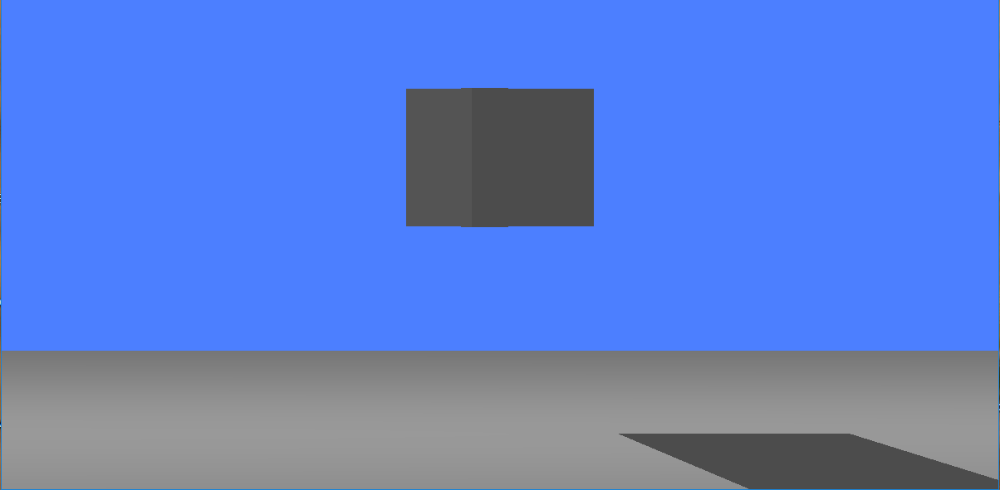
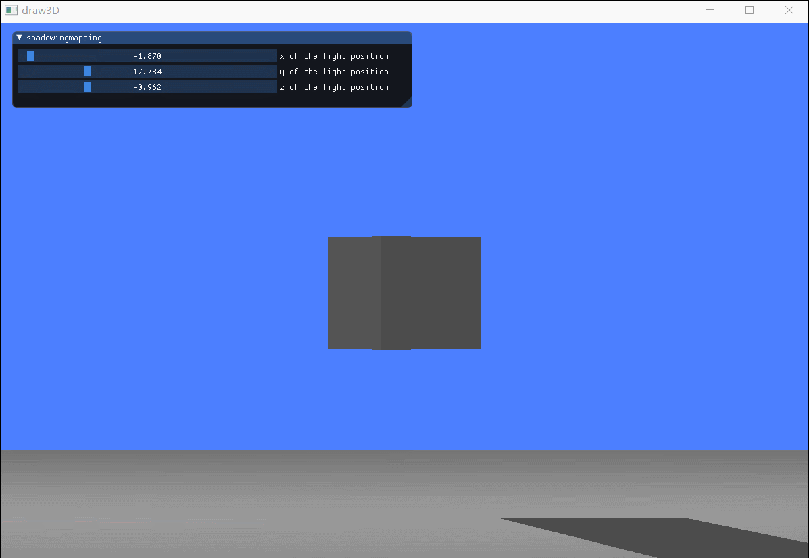
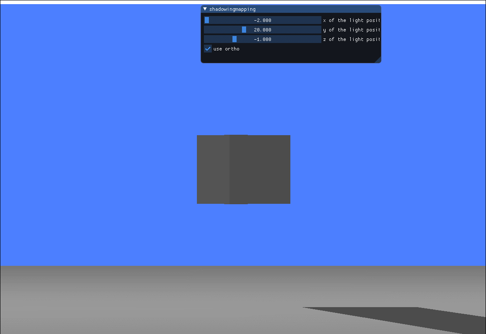
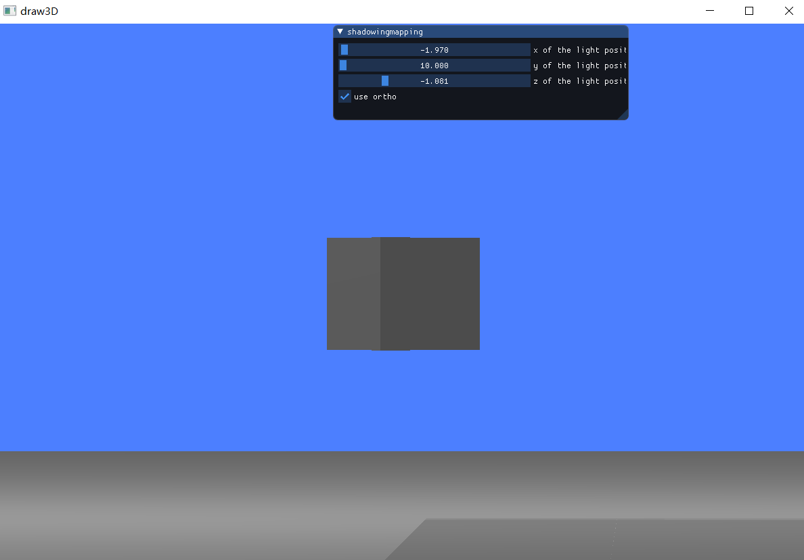

计算机图形学第七次作业

[TOC]


## 1.实现方向光源的Shadowing Mapping

### 1.1 要求场景中至少有一个object和一块平面(用于显示shadow)

  - 写出正方体的顶点坐标

  ```c++
  GLfloat vertices[] = {
	-0.1f, -0.1f, -0.1f, 0.0f, 0.0f, -1.0f, 0.0f, 0.0f,
	0.1f, 0.1f, -0.1f, 0.0f, 0.0f, -1.0f, 1.0f, 1.0f,
	0.1f, -0.1f, -0.1f, 0.0f, 0.0f, -1.0f, 1.0f, 0.0f,
	0.1f, 0.1f, -0.1f, 0.0f, 0.0f, -1.0f, 1.0f, 1.0f,
	-0.1f, -0.1f, -0.1f, 0.0f, 0.0f, -1.0f, 0.0f, 0.0f,
	-0.1f, 0.1f, -0.1f, 0.0f, 0.0f, -1.0f, 0.0f, 1.0f,

	-0.1f, -0.1f, 0.1f, 0.0f, 0.0f, 1.0f, 0.0f, 0.0f,
	0.1f, -0.1f, 0.1f, 0.0f, 0.0f, 1.0f, 1.0f, 0.0f,
	0.1f, 0.1f, 0.1f, 0.0f, 0.0f, 1.0f, 1.0f, 1.0f,
	0.1f, 0.1f, 0.1f, 0.0f, 0.0f, 1.0f, 1.0f, 1.0f,
	-0.1f, 0.1f, 0.1f, 0.0f, 0.0f, 1.0f, 0.0f, 1.0f,
	-0.1f, -0.1f, 0.1f, 0.0f, 0.0f, 1.0f, 0.0f, 0.0f,

	-0.1f, 0.1f, 0.1f, -1.0f, 0.0f, 0.0f, 1.0f, 0.0f,
	-0.1f, 0.1f, -0.1f, -1.0f, 0.0f, 0.0f, 1.0f, 1.0f,
	-0.1f, -0.1f, -0.1f, -1.0f, 0.0f, 0.0f, 0.0f, 1.0f,
	-0.1f, -0.1f, -0.1f, -1.0f, 0.0f, 0.0f, 0.0f, 1.0f,
	-0.1f, -0.1f, 0.1f, -1.0f, 0.0f, 0.0f, 0.0f, 0.0f,
	-0.1f, 0.1f, 0.1f, -1.0f, 0.0f, 0.0f, 1.0f, 0.0f,

	0.1f, 0.1f, 0.1f, 1.0f, 0.0f, 0.0f, 1.0f, 0.0f,
	0.1f, -0.1f, -0.1f, 1.0f, 0.0f, 0.0f, 0.0f, 1.0f,
	0.1f, 0.1f, -0.1f, 1.0f, 0.0f, 0.0f, 1.0f, 1.0f,
	0.1f, -0.1f, -0.1f, 1.0f, 0.0f, 0.0f, 0.0f, 1.0f,
	0.1f, 0.1f, 0.1f, 1.0f, 0.0f, 0.0f, 1.0f, 0.0f,
	0.1f, -0.1f, 0.1f, 1.0f, 0.0f, 0.0f, 0.0f, 0.0f,

	-0.1f, -0.1f, -0.1f, 0.0f, -1.0f, 0.0f, 0.0f, 1.0f,
	0.1f, -0.1f, -0.1f, 0.0f, -1.0f, 0.0f, 1.0f, 1.0f,
	0.1f, -0.1f, 0.1f, 0.0f, -1.0f, 0.0f, 1.0f, 0.0f,
	0.1f, -0.1f, 0.1f, 0.0f, -1.0f, 0.0f, 1.0f, 0.0f,
	-0.1f, -0.1f, 0.1f, 0.0f, -1.0f, 0.0f, 0.0f, 0.0f,
	-0.1f, -0.1f, -0.1f, 0.0f, -1.0f, 0.0f, 0.0f, 1.0f,

	-0.1f, 0.1f, -0.1f, 0.0f, 1.0f, 0.0f, 0.0f, 1.0f,
	0.1f, 0.1f, 0.1f, 0.0f, 1.0f, 0.0f, 1.0f, 0.0f,
	0.1f, 0.1f, -0.1f, 0.0f, 1.0f, 0.0f, 1.0f, 1.0f,
	0.1f, 0.1f, 0.1f, 0.0f, 1.0f, 0.0f, 1.0f, 0.0f,
	-0.1f, 0.1f, -0.1f, 0.0f, 1.0f, 0.0f, 0.0f, 1.0f,
	-0.1f, 0.1f, 0.1f, 0.0f, 1.0f, 0.0f, 0.0f, 0.0f
};
  ```

- 写出平面的顶点坐标

```c++
//设置平面坐标
GLfloat planeVertices[] = {
		// 顶点坐标          // 正交向量        // 纹理坐标
	50.0f, -0.4f, 50.0f, 0.0f, 1.0f, 0.0f, 1.0f, 0.1f,
	-50.0f, -0.4f, -50.0f, 0.0f, 1.0f, 0.0f, 0.0f, 1.0f,
	-50.0f, -0.4f, 50.0f, 0.0f, 1.0f, 0.0f, 0.0f, 0.0f,

	50.0f, -0.4f, 50.0f, 0.0f, 1.0f, 0.0f, 1.0f, 0.0f,
	50.0f, -0.4f, -50.0f, 0.0f, 1.0f, 0.0f, 1.0f, 1.0f,
	-50.0f, -0.4f, -50.0f, 0.0f, 1.0f, 0.0f, 0.0f, 0.0f
};
```

- 设置平面和方块的VAO

```c++
// 设置平面VAO
GLuint planeVBO;
glGenVertexArrays(1, &planeVAO);
glGenBuffers(1, &planeVBO);
glBindVertexArray(planeVAO);
glBindBuffer(GL_ARRAY_BUFFER, planeVBO);
glBufferData(GL_ARRAY_BUFFER, sizeof(planeVertices), &planeVertices, GL_STATIC_DRAW);
glEnableVertexAttribArray(0);
glVertexAttribPointer(0, 3, GL_FLOAT, GL_FALSE, 8 * sizeof(GLfloat), (GLvoid*)0);
glEnableVertexAttribArray(1);
glVertexAttribPointer(1, 3, GL_FLOAT, GL_FALSE, 8 * sizeof(GLfloat), (GLvoid*)(3 * sizeof(GLfloat)));
glEnableVertexAttribArray(2);
glVertexAttribPointer(2, 2, GL_FLOAT, GL_FALSE, 8 * sizeof(GLfloat), (GLvoid*)(6 * sizeof(GLfloat)));
glBindVertexArray(0);
//设置方块VAO
GLuint cubeVAO = 0;
GLuint cubeVBO = 0;
glGenVertexArrays(1, &cubeVAO);
glGenBuffers(1, &cubeVBO);
glBindBuffer(GL_ARRAY_BUFFER, cubeVBO);
glBufferData(GL_ARRAY_BUFFER, sizeof(vertices), vertices, GL_STATIC_DRAW);
glBindVertexArray(cubeVAO);
glEnableVertexAttribArray(0);
glVertexAttribPointer(0, 3, GL_FLOAT, GL_FALSE, 8 * sizeof(GLfloat), (GLvoid*)0);
glEnableVertexAttribArray(1);
glVertexAttribPointer(1, 3, GL_FLOAT, GL_FALSE, 8 * sizeof(GLfloat), (GLvoid*)(3 * sizeof(GLfloat)));
glEnableVertexAttribArray(2);
glVertexAttribPointer(2, 2, GL_FLOAT, GL_FALSE, 8 * sizeof(GLfloat), (GLvoid*)(6 * sizeof(GLfloat)));
glBindBuffer(GL_ARRAY_BUFFER, 0);
glBindVertexArray(0);
```

- 加载纹理

```c++
// 加载纹理

glGenTextures(1, &colourtexture);
glBindTexture(GL_TEXTURE_2D, colourtexture);
//指定纹理属性
glTexParameteri(GL_TEXTURE_2D, GL_TEXTURE_WRAP_S, GL_REPEAT);
glTexParameteri(GL_TEXTURE_2D, GL_TEXTURE_WRAP_T, GL_REPEAT);
glTexParameteri(GL_TEXTURE_2D, GL_TEXTURE_MIN_FILTER, GL_LINEAR);
glTexParameteri(GL_TEXTURE_2D, GL_TEXTURE_MAG_FILTER, GL_LINEAR);
// 加载图片
int width, height, nrChannels;
stbi_set_flip_vertically_on_load(true); // tell stb_image.h to flip loaded texture's on the y-axis.
unsigned char *data = stbi_load("img/white.png", &width, &height, &nrChannels, 0);
if (data) {
	glTexImage2D(GL_TEXTURE_2D, 0, GL_RGB, width, height, 0, GL_RGB, GL_UNSIGNED_BYTE, data);
	glGenerateMipmap(GL_TEXTURE_2D);
}
else {
	cout << "图片加载失败！\n";
}
```


### 1.2 使用透视投影来显示阴影

> 阴影映射(Shadow Mapping)背后的思路非常简单：我们以光的位置为视角进行渲染，我们能看到的东西都将被点亮，看不见的一定是在阴影之中了。一个简单的想法是对光源发出的射线上的点进行遍历，并记录第一个与物体相交的点。如果在这条光射线上的点比这个交点距离光源的距离更远，那么较远的点处在阴影之中。但是遍历这些点的开销极大，因而是不切实际的，因此实际的做法是从光源的透视图来渲染场景，并将深度值的结果存储在纹理之中——也就是说，对光源的透视图所见的最近的深度值进行采样，所得到的这个深度值就是我们在光源的角度下透视图能够见到的第一个片元。所有的这些深度值被称作深度贴图（depth map），详细步骤和对应代码如下。

- 为深度图建立一个帧缓冲对象，以将深度贴图存储在纹理中

```c++
GLuint depthMapFBO;
glGenFramebuffers(1, &depthMapFBO);
```

- 把生成的深度纹理作为帧缓冲的深度缓冲附加到帧缓冲

```c++
// 创建一个2D纹理，提供给帧缓冲的深度缓冲使用
GLuint depthMap;
glGenTextures(1, &depthMap);
glBindTexture(GL_TEXTURE_2D, depthMap);

glTexImage2D(GL_TEXTURE_2D, 0, GL_DEPTH_COMPONENT, SHADOW_WIDTH, SHADOW_HEIGHT, 0, GL_DEPTH_COMPONENT, GL_FLOAT, NULL);
glTexParameteri(GL_TEXTURE_2D, GL_TEXTURE_MIN_FILTER, GL_NEAREST);
glTexParameteri(GL_TEXTURE_2D, GL_TEXTURE_MAG_FILTER, GL_NEAREST);
glTexParameteri(GL_TEXTURE_2D, GL_TEXTURE_WRAP_S, GL_REPEAT);
glTexParameteri(GL_TEXTURE_2D, GL_TEXTURE_WRAP_T, GL_REPEAT);

glBindFramebuffer(GL_FRAMEBUFFER, depthMapFBO);
glFramebufferTexture2D(GL_FRAMEBUFFER, GL_DEPTH_ATTACHMENT, GL_TEXTURE_2D, depthMap, 0);
glDrawBuffer(GL_NONE);
glReadBuffer(GL_NONE);
glBindFramebuffer(GL_FRAMEBUFFER, 0);
```

  - 渲染深度贴图，然后使用深度贴图渲染场景

```c++
simpleDepthShader.usepro();
glUniformMatrix4fv(glGetUniformLocation(simpleDepthShader.programid, "lightSpaceMatrix"), 1, GL_FALSE, glm::value_ptr(lightSpaceMatrix));
glViewport(0, 0, SHADOW_WIDTH, SHADOW_HEIGHT);
glBindFramebuffer(GL_FRAMEBUFFER, depthMapFBO);
glClear(GL_DEPTH_BUFFER_BIT);
RenderScene(simpleDepthShader);
glBindFramebuffer(GL_FRAMEBUFFER, 0);
glViewport(0, 0, SCR_WIDTH, SCR_HEIGHT);
glClearColor(0.3f, 0.5f, 1.0f, 1.0f);
glClear(GL_COLOR_BUFFER_BIT | GL_DEPTH_BUFFER_BIT);
shader.usepro();
glm::mat4 projection = glm::perspective(glm::radians(45.0f), (float)SCR_WIDTH / (float)SCR_HEIGHT, 0.1f, 100.0f);
glm::vec3 viewpos = glm::vec3(sin(rotate)*radius, 0.0f, cos(rotate)*radius);
glm::mat4 view = glm::lookAt(viewpos, glm::vec3(0.0, 0.0, 0.0), glm::vec3(0.0f, 1.0, 0.0f));
glUniformMatrix4fv(glGetUniformLocation(shader.programid, "projection"), 1, GL_FALSE, glm::value_ptr(projection));
glUniformMatrix4fv(glGetUniformLocation(shader.programid, "view"), 1, GL_FALSE, glm::value_ptr(view));
// 传递光照各项参数
glUniform3fv(glGetUniformLocation(shader.programid, "lightPos"), 1, &lightPos[0]);
glUniform3fv(glGetUniformLocation(shader.programid, "viewPos"), 1, &viewpos[0]);
glUniformMatrix4fv(glGetUniformLocation(shader.programid, "lightSpaceMatrix"), 1, GL_FALSE, glm::value_ptr(lightSpaceMatrix));
glActiveTexture(GL_TEXTURE0);
glBindTexture(GL_TEXTURE_2D, colourtexture);
glActiveTexture(GL_TEXTURE1);
glBindTexture(GL_TEXTURE_2D, depthMap);
RenderScene(shader);
```

  - shadow_mapping.fs：**将深度贴图渲染到四边形上** 

```c++
#version 330 core
out vec4 FragColor;

in VS_OUT {
    vec3 FragPos;
    vec3 Normal;
    vec2 TexCoords;
    vec4 FragPosLightSpace;
} fs_in;

uniform sampler2D diffuseTexture;
uniform sampler2D shadowMap;

uniform vec3 lightPos;
uniform vec3 viewPos;

float ShadowCalculation(vec4 fragPosLightSpace)
{
    // 完成透视除法
    vec3 projCoords = fragPosLightSpace.xyz / fragPosLightSpace.w;
    // 转换到01之间
    projCoords = projCoords * 0.5 + 0.5;
    // 取得最近点的深度(使用[0,1]范围下的fragPosLight当坐标)
    float closestDepth = texture(shadowMap, projCoords.xy).r; 
    // 取得当前片元在光源视角下的深度
    float currentDepth = projCoords.z;
    // 检查当前片元是否在阴影中
    float shadow = currentDepth > closestDepth  ? 1.0 : 0.0;

    return shadow;
}

void main()
{           
    vec3 color = texture(diffuseTexture, fs_in.TexCoords).rgb;
    vec3 normal = normalize(fs_in.Normal);
    vec3 lightColor = vec3(0.3);

    vec3 ambient = 0.3 * color;

    vec3 lightDir = normalize(lightPos - fs_in.FragPos);
    float diff = max(dot(lightDir, normal), 0.0);
    vec3 diffuse = diff * lightColor;

    vec3 viewDir = normalize(viewPos - fs_in.FragPos);
    vec3 reflectDir = reflect(-lightDir, normal);
    float spec = 0.0;
    vec3 halfwayDir = normalize(lightDir + viewDir);  
    spec = pow(max(dot(normal, halfwayDir), 0.0), 64.0);
    vec3 specular = spec * lightColor;    

    float shadow = ShadowCalculation(fs_in.FragPosLightSpace);                      
    vec3 lighting = (ambient + (1.0 - shadow) * (diffuse + specular)) * color;    
    
    FragColor = vec4(lighting, 1.0);
}
```

- shadow_mapping.vs：**将顶点变换到光源空间**

```c++
#version 330 core
layout (location = 0) in vec3 aPos;
layout (location = 1) in vec3 aNormal;
layout (location = 2) in vec2 aTexCoords;

out vec2 TexCoords;

out VS_OUT {
    vec3 FragPos;
    vec3 Normal;
    vec2 TexCoords;
    vec4 FragPosLightSpace;
} vs_out;

uniform mat4 projection;
uniform mat4 view;
uniform mat4 model;
uniform mat4 lightSpaceMatrix;

void main(){
    vs_out.FragPos = vec3(model * vec4(aPos, 1.0));
    vs_out.Normal = transpose(inverse(mat3(model))) * aNormal;
    vs_out.TexCoords = aTexCoords;
    vs_out.FragPosLightSpace = lightSpaceMatrix * vec4(vs_out.FragPos, 1.0);
    gl_Position = projection * view * model * vec4(aPos, 1.0);
}
```

效果如图：




### 1.3 添加GUI改变光源位置

```c++
// 设置光源坐标
float pos1 = -2.0f;
float pos2 = 20.0f;
float pos3 = -1.0f;
glm::vec3 lightPos(pos1, pos2, pos3);

ImGui_ImplOpenGL3_NewFrame();
ImGui_ImplGlfw_NewFrame();
ImGui::NewFrame();
ImGui::Begin("shadowingmapping");
ImGui::SliderFloat("x of the light position", &pos1, -2.0f, 2.0f);
ImGui::SliderFloat("y of the light position", &pos2, 10.0f, 40.0f);
ImGui::SliderFloat("z of the light position", &pos3, -2.0f, 2.0f);
ImGui::End();
ImGui::Render();
ImGui_ImplOpenGL3_RenderDrawData(ImGui::GetDrawData())
    
lightPos.x = pos1;
lightPos.y = pos2;
lightPos.z = pos3;
```

效果如下图所示：




## 2.bonus

### 2.1 添加透视投影

```c++
bool use_ortho = true;
if (use_ortho) {
	lightProjection = glm::ortho(0.0f, 600.0f, 800.0f, 0.0f, near_plane, far_plane);
}
else {
	lightProjection = glm::perspective(glm::radians(45.0f), (float)SCR_WIDTH / (float)SCR_HEIGHT, 60.0f, 200.0f);
}
ImGui::Checkbox("use ortho", &use_ortho);
```




### 2.2使用PCF优化Shadowing Mapping

>PCF的思路是从纹理像素四周对深度贴图采样，然后对不同的结果进行平均即可得到较柔和的阴影，实现如下：

```c++
#version 330 core
out vec4 FragColor;

in VS_OUT {
    vec3 FragPos;
    vec3 Normal;
    vec2 TexCoords;
    vec4 FragPosLightSpace;
} fs_in;

uniform sampler2D diffuseTexture;
uniform sampler2D shadowMap;

uniform vec3 lightPos;
uniform vec3 viewPos;

float ShadowCalculation(vec4 fragPosLightSpace)
{
    // 完成透视除法
    vec3 projCoords = fragPosLightSpace.xyz / fragPosLightSpace.w;
    // 转换到01之间
    projCoords = projCoords * 0.5 + 0.5;
    // 取得最近点的深度(使用[0,1]范围下的fragPosLight当坐标)
    float closestDepth = texture(shadowMap, projCoords.xy).r; 
    // 取得当前片元在光源视角下的深度
    float currentDepth = projCoords.z;
    // 检查当前片元是否在阴影中
    //float shadow = currentDepth > closestDepth  ? 1.0 : 0.0;
	float shadow = 0.0;
	vec2 texelSize = 1.0 / textureSize(shadowMap, 0);
	for(int x = -1; x <= 1; ++x) {
		for(int y = -1; y <= 1; ++y){
			float pcfDepth = texture(shadowMap, projCoords.xy + vec2(x, y) * texelSize).r; 
			shadow += currentDepth > pcfDepth ? 1.0 : 0.0;        
		}    
	}
	shadow /= 9.0;
    return shadow;
}

void main()
{           
    vec3 color = texture(diffuseTexture, fs_in.TexCoords).rgb;
    vec3 normal = normalize(fs_in.Normal);
    vec3 lightColor = vec3(0.3);

    vec3 ambient = 0.3 * color;

    vec3 lightDir = normalize(lightPos - fs_in.FragPos);
    float diff = max(dot(lightDir, normal), 0.0);
    vec3 diffuse = diff * lightColor;

    vec3 viewDir = normalize(viewPos - fs_in.FragPos);
    vec3 reflectDir = reflect(-lightDir, normal);
    float spec = 0.0;
    vec3 halfwayDir = normalize(lightDir + viewDir);  
    spec = pow(max(dot(normal, halfwayDir), 0.0), 64.0);
    vec3 specular = spec * lightColor;    

    float shadow = ShadowCalculation(fs_in.FragPosLightSpace);                      
    vec3 lighting = (ambient + (1.0 - shadow) * (diffuse + specular)) * color;    
    
    FragColor = vec4(lighting, 1.0);
}
```


图片效果：可以看到与之前相比柔和了许多。



