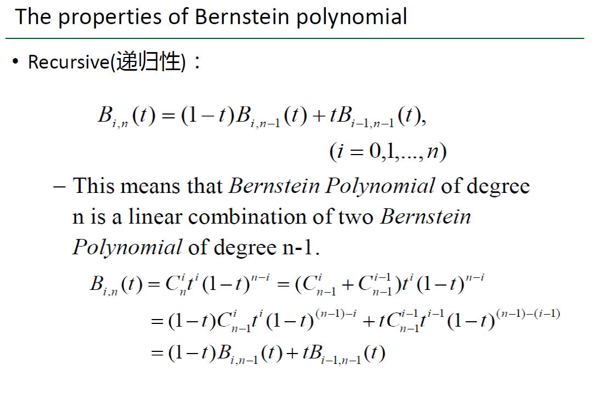

计算机图形学第八次作业

[TOC]


## 1.实现一个Bezier Curve的绘制小工具

### 1.1 用户能通过左键点击添加Bezier曲线的控制点，右键点击则对当前添加的最后一个控制点进行消除

  - 为方便计算，定义顶点类并进行测试，为了便于运算定义了乘法、加法和赋值，为了便于排序定义了小于。

  ```c++
class MYPOINT {
public:
	float x;
	float y;
	MYPOINT();
	MYPOINT(float x, float y);
	~MYPOINT();
	MYPOINT operator*(float m);//乘法  
	MYPOINT operator+(MYPOINT p);//加法  
	void operator=(MYPOINT p);//赋值
	bool operator<(MYPOINT p);//小于
};

MYPOINT::MYPOINT() {
	this->x = .0f;
	this->y = .0f;
}

MYPOINT::MYPOINT(float x, float y) {
	this->x = x;
	this->y = y;
}

MYPOINT::~MYPOINT() {
	;
}

MYPOINT MYPOINT::operator*(float m) {
	MYPOINT c(this->x*m, this->y*m);
	return c;
}

MYPOINT MYPOINT::operator+(MYPOINT p) {
	MYPOINT c(this->x+p.x, this->y+p.y);
	return c;
}

void MYPOINT::operator=(MYPOINT p) {
	this->x = p.x;
	this->y = p.y;
}

bool MYPOINT::operator<(MYPOINT p) {
	return this->x < p.x;
}


int main() {
	MYPOINT p(1, 3);
	p = p * 3;
	p = p + p;
	cout << p.x << p.y;
}

  ```

- 设计对B(t)进行计算的递归函数

> 下面是老师上课写的递归性原理



```c++
MYPOINT getB(vector<MYPOINT> points, float t, int i, int n) {
	if (n == 0) {
		return points[i];
	}
	return getB(points, t, i-1, n-1) * (1-t)+ getB(points, t, i, n-1) * t;
}
```

- 将顶点类转换为float数组，每一行的六个参数分别为x、y、z坐标以及颜色。

```c++
//将二维坐标转换为vertices数组，第一个vector是绘制点的，第二个vector是绘制线的
float* points_to_vertices(vector<MYPOINT>points, vector<MYPOINT>controlpoints) {
	//有几个点
	int num = points.size();
	//要画的线需要几个端点
	int linenum = 2 * (controlpoints.size() - 1);
	float* vertices = new float[num * 6 + linenum * 6];
	for (int i = 0; i < num; i++) {
		vertices[i * 6] = points[i].x;
		vertices[i * 6 + 1] = points[i].y;
		vertices[i * 6 + 2] = 0.0f;
		vertices[i * 6 + 3] = 0.0f;
		vertices[i * 6 + 4] = 0.0f;
		vertices[i * 6 + 5] = 1.0f;
	}
	int current = num * 6;
	for (int i = 0; i < controlpoints.size() - 1; i++) {
		vertices[current++] = controlpoints[i].x;
		vertices[current++] = controlpoints[i].y;
		vertices[current++] = 0.0f;
		vertices[current++] = 1.0f;
		vertices[current++] = 1.0f;
		vertices[current++] = 1.0f;
		vertices[current++] = controlpoints[i + 1].x;
		vertices[current++] = controlpoints[i + 1].y;
		vertices[current++] = 0.0f;
		vertices[current++] = 1.0f;
		vertices[current++] = 1.0f;
		vertices[current++] = 1.0f;
	}
	return vertices;
}
```

- 完成鼠标点击事件发生时的回调函数，注意要对屏幕坐标进行标准化，以将其转化为opengl的坐标。注意当点击鼠标右键时不能无限制地从vector中删除控制点，当vector为空就要停止。

```c++
//定义存储控制点的全局变量
vector<MYPOINT> P;
//定义状态是否发生了改变
bool if_state_change = false;
//鼠标点击的回调函数
void mouse_button_callback(GLFWwindow* window, int button, int action, int mods) {
	if (button == GLFW_MOUSE_BUTTON_LEFT && action == GLFW_PRESS) {
		double xpos, ypos;
		glfwGetCursorPos(window, &xpos, &ypos);
		P.push_back(MYPOINT(float((xpos - 400.0) / 400.0), float((400.0 - ypos) / 400.0)));
		//P.push_back(MYPOINT(float(xpos), float(ypos)));
		if_state_change = true;
		cout << xpos << " " << ypos << endl;
	}
	else {
		if (button == GLFW_MOUSE_BUTTON_RIGHT && action == GLFW_PRESS) {
			if (!P.empty()) {
				P.pop_back();
				if_state_change = true;
			}
		}
	}
}

//点击鼠标的函数
glfwSetMouseButtonCallback(mwindow, mouse_button_callback);
```


### 1.2 工具根据鼠标绘制的控制点实时更新Bezier曲线。

- 定义VAO和VBO的对象，以灵活绘制顶点

```c++
//使用VAO和VBO完成数据的存储和解析
	unsigned int VBOID, VAOID;
	//分别创建这两个对象，第一个参数的含义为返回当前n个未使用的名称
	glGenVertexArrays(1, &VAOID);
	glGenBuffers(1, &VBOID);
	glBindVertexArray(0);
```

- 判断状态是否改变，也就是是否有鼠标点击事件，若有则更新vertices

```c++
//构建顶点
float* vertices = NULL;
int num_of_points = 400;
if (if_state_change) {
	int num = P.size();
	if (num > 1) {
		vector<MYPOINT> temp = P;
		//对各个控制点按照从左到右的顺序进行排序
		sort(temp.begin(), temp.end());
		vector<MYPOINT> everypoints;
		float t = .0f;
		for (unsigned int i = 0; i < num_of_points; i++) {
			t += 1.0f / num_of_points;
			everypoints.push_back(getB(temp, t, num - 1, num - 1));
			cout << everypoints.back().x << " " << everypoints.back().y << endl;
		}
		vertices = points_to_vertices(everypoints, temp);
	}
	else {
		num_of_points = 0;
	}
	if_state_change = false;
}
```

  - 实时渲染点和线段

```c++
//将顶点数据复制到缓冲的内存中（VBO）
glBufferData(GL_ARRAY_BUFFER, 6 * (num_of_points + 2 * (P.size() - 1)) * sizeof(float), vertices, GL_STATIC_DRAW);
//指定要修改的着色器的顶点变量ID并且启用其属性
glVertexAttribPointer(0, 3, GL_FLOAT, GL_FALSE, 6 * sizeof(float), (void*)0);
glEnableVertexAttribArray(0);
glVertexAttribPointer(1, 3, GL_FLOAT, GL_FALSE, 6 * sizeof(float), (void*)(3 * sizeof(float)));
glEnableVertexAttribArray(1);
//解除绑定
glDrawArrays(GL_POINTS, 0, num_of_points);
if (P.size() > 1) {
	glDrawArrays(GL_LINES, num_of_points, 2 * (P.size() - 1));
}
glBindVertexArray(0);
glBindBuffer(GL_ARRAY_BUFFER, 0);
delete vertices;
newshader.freepro();
glfwMakeContextCurrent(mwindow);
glfwSwapBuffers(mwindow);
```

- 效果图


## Bonus：可以动态地呈现Bezier曲线的生成过程。

- 递归时保存中间结果

```c++
//保存中间结果
MYPOINT getDB(vector<MYPOINT> points, float t, int i, int n, vector<MYPOINT>&result) {
	if (n == 0) {
		//result.push_back(points[i]);
		return points[i];	
	}
	MYPOINT x = getDB(points, t, i - 1, n - 1, result) * (1 - t) + getDB(points, t, i, n - 1, result) * t;
	result.push_back(x);
	return x;
}
```

- 将中间结果转换成坐标表示

```c++
float* vertices = new float[12 * (points.size() - 1)];
int current = 0;
for (int i = 0; i < points.size() - 1; i++) {
	vertices[current++] = points[i].x;
	vertices[current++] = points[i].y;
	vertices[current++] = 0.0f;
	vertices[current++] = 1.0f;
	vertices[current++] = 1.0f;
	vertices[current++] = 1.0f;
	vertices[current++] = points[i + 1].x;
	vertices[current++] = points[i + 1].y;
	vertices[current++] = 0.0f;
	vertices[current++] = 1.0f;
	vertices[current++] = 1.0f;
	vertices[current++] = 1.0f;
}
return vertices;
}
```

- 让t随时间改变，获得动态效果

```c++
int num = P.size();
float tt = (int)(float(glfwGetTime()*500.f)) % 500 / 500.f;
vector<MYPOINT> dynamicpoints;
if (num > 1) {
	getDB(P, tt, num - 1, num - 1, dynamicpoints);
	dvertices = dynamicpoints_to_vertices(dynamicpoints);
}
```

- 效果图

